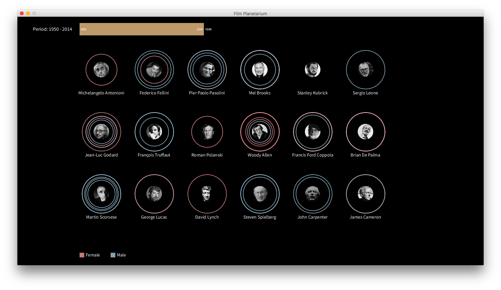
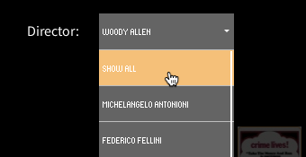
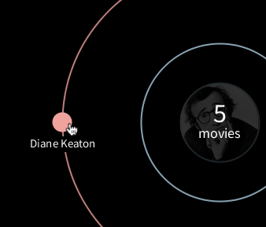
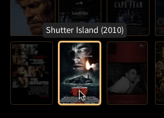

# Film Planetarium
**Interactive Information Visualization 2015-2016**  
Université Paris-Sud

## Authors

Nam Giang  
Francesco Vitale

## How to run the project

* Check that the Processing library [controlP5](http://www.sojamo.de/libraries/controlP5/) is installed.
* Open the folder `movieviz`, the open the file `movieviz.pde` with Processing.
* Click Run.

## Table of contents

- Introduction
- Dataset description
- Data encoding
- Interaction
- Findings
- Limitations
- Future work
- Credits
- Appendix

## Introduction

The visualisation shows a list of **influential movie directors** and the **actors** they most frequently worked with. We took inspiration from [Constellations of Directors and Their Stars](http://www.nytimes.com/newsgraphics/2013/09/07/director-star-chart/), an online visualisation from 2013. We added more dimensions, interactivity, and took a different design approach.

We visualised the relationship between a director and his top collaborators as a **solar system**: the director is the sun and the collaborators are the planets. The dimension of time, makes it possible to see how the collaborators rotate around the director: they mover farther away or closer, as the years go by.

Our main research question was: **how does the collaboration between a director and a group of actors evolve over time?** 

We also wanted to see what role **gender** plays in the dynamic.

## Dataset description

We used a custom dataset. It contains a list of movies from a list of influential movie directors who started working between 1950 and 1980 (the complete list is at the end of this file).

We compiled the dataset using [OMDb API](http://www.omdbapi.com/), a free service built on top of [IMDb](http://www.imdb.com/).

Each movie has multiple dimensions (e.g., title, year, directors, actors, etc.) A list of all the dimensions is at the end of this file.

We created two additional datasets:   

* `directors.csv` contains the list of directors and the year they were born in.
* `actors.csv` contains the top collaborators for each director and their gender. 

We created the second dataset only at the end of the development: we used the application to output the list of actors. Then, we added the gender of each actor manually.

## Data encoding

As explained in the introduction, we used the solar system as a metaphor to display our data. 

The visualisation consists of two main views: an overview with all directors and a detailed view for each director. We applied the **Visual Information Seeking Mantra** by Shneiderman (“Overview first, zoom and filter, then details on demand”) to structure our design and interaction.

### Overview
In the overview you see all directors with a condensed visualisation of their collaborators. We used Edward Tufte’s concept of **small multiples** to create a grid that gives a first impression of the data.

### Director’s view
In the detailed director’s view you see more information on his collaborators. We only show actors who have worked with the director in **at least three movies**. The number of movies they have starred in determines the distance from the director: the closer they are to the director, the more movies they have starred in. 

### Colors
We used two colors (pink and blue) to show respectively female and male actors. These colors, while stereotypical, have an immediate cultural meaning that is almost universal. 

## Interaction

### Zoom on the director
In the overview, you can **click** on a director and zoom in on his career. You’ll see more details. 

Then, you can use a dropdown list in the top right of the visualisation to navigate:

* Choose "Show all" to go back to the overview.
* Choose another director and you’ll go to a different detailed view.

### Filter by year
In any view, the slider in the top of the visualisation makes it possible to filter the content by year:

* You can filter one year at a time or use a custom range. The slider is mouse-activated.
* By default it shows a range of 10 years. You can **drag** the range to the left or to the right and move between decades:

* You can expand or shrink the range by using two handles, on the left and the right of the range. You can **click** on the handle and **drag** it to the left or to the right. The range will change accordingly:

### Get details on the actor
In the detailed view of any director, you can **hover** or **click** on the actors, represented as planets (i.e., filled circles).

* By hovering on an actor, you can see how many movies they have starred in.
* By clicking on an actor, you can see the movies they have starred in: their posters will highlight in the list of movies on the right.

### Get details on the movie
You can **hover** on the movie poster to see the title and the year.

## Findings

* Some directors are their own most frequent collaborator. For example, Woody Allen and Jean-Luc Godard have cast themselves in many movies.
* Some directors have close collaborations mostly with male actors (e.g., Mel Brooks, Pier Paolo Pasolini, Martin Scorsese), while others with female actors (e.g., Woody Allen, Jean-Luc Godard, David Lynch).
* There doesn’t seem to be a direct correlation between the ratio of male/female actors and the total number of collaborators.

## Limitations

* Our list of directors is arbitrary and not diverse, because there are no women: this is not intentional, but it reflects the nature of the movie industry. It was difficult to find an influential woman director who started working between 1950 and 1980. However, this prompted us to explore the influence of gender in the relationship between directors and their collaborators. 
* In the dataset, each movie has **only four actors**: they are the first four actors listed on IMDB by credits order. In most cases, they are the main actors from the movie, but in some cases this is not true. Therefore, the number and order of the actors as listed on IMDb influences what is visible in the visualisation. Each director might be missing some collaborators. Unfortunately, this is a limitation of the OMDb API.
* Some movies don’t have a poster.
* In the visualisation we excluded two directors from the dataset (Bernardo Bertolucci, George Romero), because they don’t show any close collaborators. Stanley Kubrick also doesn’t have any close collaborators, but we decided to keep him to show what happens when that’s case.
* Using the controlP5 library limited our control over the design and interaction of two components, the year slider and the dropdown list with all directors. For example, we were not able to customise the font to make it consistent with the rest of the visualisation. 

## Future work

* Further explore the relationship between gender and movies: expand the list of directors to include influential women directors from later decades.
* Shift the list of directors to another generation: for example, directors who started working after 1990.
* Expand the visualisation to include more dimensions (e.g., critic and user ratings for the movies, box office data, genres, or semantic data extracted from the plot descriptions) and explore relationships between them.
* Improve the interaction.

## Credits

* We used [controlP5](http://www.sojamo.de/libraries/controlP5/) to create the year slider and the dropdown list.
* We used examples from the Processing [reference](https://processing.org/reference/) and [forums](https://forum.processing.org). In particular, we adapted [an example](https://forum.processing.org/one/topic/distribute-shapes-around-circle-dependant-on-arc-length#25080000001373377.html) to arrange the actor planets on a circular pattern.
* We referred to the course assignments to read the dataset and build part of the interaction on mouse hover and click.
* The movie posters come from IMDb. The grid layout of the movies was inspired by the website [Letterboxd](http://letterboxd.com/).
* The pictures of the directors come from multiple sources and fall under fair use. No copyright infringement is intended.
* We used [ColorBrewer](http://colorbrewer2.org/) to choose the colors.
* The font used is [Source Sans Pro](https://github.com/adobe-fonts/source-sans-pro), an open-source font by Adobe.

## Appendix

### List of directors

Ordered by the year they were born in, as displayed in the overview:

* Michelangelo Antonioni
* Federico Fellini
* Pier Paolo Pasolini
* Mel Brooks
* Stanley Kubrick
* Sergio Leone
* Jean-Luc Godard
* François Truffaut
* Roman Polanski
* Woody Allen
* Francis Ford Coppola
* George Romero (*not shown in the visualisation*)
* Brian De Palma
* Bernardo Bertolucci (*not shown in the visualisation*)
* Martin Scorsese
* George Lucas
* David Lynch
* Steven Spielberg
* John Carpenter
* James Cameron

### List of data dimensions

For each movie in the dataset (in bold the ones we used):

* **Title**
* **Year**
* Rated
* Released
* Runtime
* Genre
* **Director**
* Writer
* **Actors**
* Plot
* Language
* Country
* Awards
* **Poster**
* Metascore
* imdbRating
* imdbVotes
* imdbID
* Type
* tomatoMeter
* tomatoImage
* tomatoRating
* tomatoReviews
* tomatoFresh
* tomatoRotten
* tomatoConsensus
* tomatoUserMeter
* tomatoUserRating
* tomatoUserReviews
* DVD
* BoxOffice
* Production
* Website

### Entry example

> "What's Up, Tiger Lily?","1966","PG","02 Nov 1966","80 min","Adventure, Comedy, Crime","Woody Allen, Senkichi Taniguchi","Woody Allen, Julie Bennett, Frank Buxton, Louise Lasser, Len Maxwell, Mickey Rose, Ben Shapiro (production conception), Bryna Wilson","The Lovin' Spoonful, Frank Buxton, Len Maxwell, Louise Lasser","In comic Woody Allen's film debut, he took the Japanese action film ""International Secret Police: Key of Keys"" and re-dubbed it, changing the plot to make it revolve around a secret egg salad recipe.","English, Japanese","USA, Japan","N/A","http://ia.media-imdb.com/images/M/MV5BMjAzNTQ2MTczMF5BMl5BanBnXkFtZTYwMTcyMjg5._V1_SX300.jpg","N/A","6.1","7,412","tt0061177","movie","83","fresh","6.9","24","20","4","N/A","53","3.2","7997","15 Jul 2003","N/A","American International Pictures","N/A"